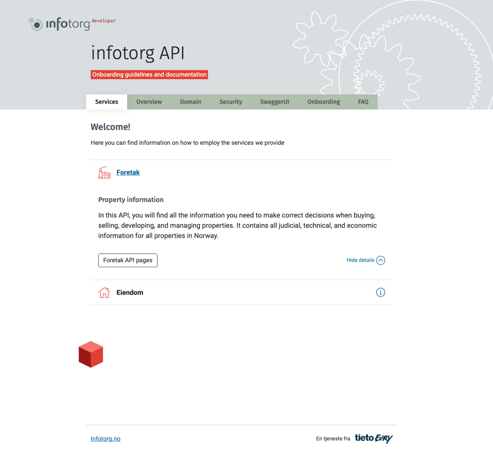
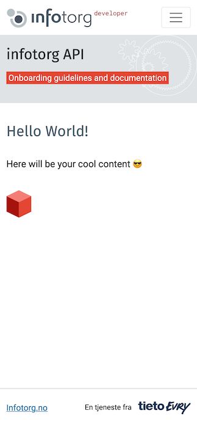

# Jekyll Infotorg APIs theme Quickstart

> Scaffold for a basic Jekyll theme for use as a reference or template

[](https://ruby-lang.org)
[](https://jekyllrb.com)
[](https://getbootstrap.com/)
[](#license)

[Theme preview](https://coderua.github.io/infotorg-api-jekyll-theme/)


## How to use this project

### Quickstart

Create a new project from this template. Or just use the code or docs here as a reference.

<div align="center">

[](https://github.com/coderua/infotorg-api-jekyll-theme/generate)

</div>

### Demo

View a live demo on GH Pages:

<div align="center">

[](https://coderua.github.io/infotorg-api-jekyll-theme/)

</div>

## What is a Jekyll theme?

If you build a Jekyll site, you'll typically use a theme to style your site or at least give a base which you and customize on top of.

A theme is a way of packaging layout files, CSS styling and includes files to be installed in another Jekyll project. A theme might be made from scratch or based on a static HTML. A theme is a great way of making styling reusable across projects by you and other people.

A good example of a theme is Minima, which is the default theme used when running `jekyll new PATH`.

[](https://github.com/jekyll/minima)

## About

### Where this project comes from

The theme scaffold was generated with this command and Jekyll 4:

```sh
$ jekyll new NAME
```

### Package a theme

The part that allows this project gem to be packaged as an installable gem-based theme is this file:

- [infotorg-api-jekyll-theme.gemspec](/infotorg-api-jekyll-theme.gemspec)

The other parts like the config and Gemfile or the layout and includes directories are standard for a Jekyll project.

Resources:

- [Creating a gem-based theme](https://jekyllrb.com/docs/themes/#creating-a-gem-based-theme) in Jekyll docs.
- [Publishing your theme](https://jekyllrb.com/docs/themes/#publishing-your-theme) in Jekyll docs.
- [Adding a theme to your GitHub Pages site using Jekyll](https://help.github.com/en/github/working-with-github-pages/adding-a-theme-to-your-github-pages-site-using-jekyll) guide on Github's help.

## Installation

>  Install this theme in your project

Two approaches are covered for installing the theme. The Remote Theme approach is necessary for plain [GH Pages](https://pages.github.com/) setup, 
while the second approach needs some kind of CI like GitHub Actions, Netlify or local development/build. Both require only a few lines of code.

### GitHub Pages Remote Theme flow

Only a few [standard themes](https://pages.github.com/themes/) are available on the locked GH Pages environment. 
So you must use this Remote Theme plugin to fetch your custom theme.

Use the [remote theme](https://github.com/benbalter/jekyll-remote-theme) approach to load a theme using GitHub details.

`_config.yml`

```yaml
####
# --- Required configuration ---
####

# Set a branch name or version at the `remote_theme` value e.g. `@main` or `@v1.0.0`.
# Be careful if you omit the branch then automatically will be used `master`. 
remote_theme: "infotorg/infotorg-api-jekyll-theme@main"
plugins:
  - jekyll-remote-theme
  - jekyll-seo-tag

####
# --- Optional configuration ---
####

# --- Site defaults configuration ---
defaults:
  - scope:
      path: ""
    values:
      # Default layout for any page that doesn't contain 'layout' option in the Front Matter.
      # (https://jekyllrb.com/docs/step-by-step/03-front-matter/) 
      layout: "default"
      show_navigation: true
sass:
  style: compressed # possible values: nested expanded compact compressed


# --- Site data configuration ---

# Sets a page language in the `<html lang="YOUR-LOCALE">` tag
lang: en-US

# Sets a visible site title in a page header.
# As well used as a part of title in a <title> tag.
# For a "Security" page will looks: <title>Security | infotorg API</title>
title: infotorg API

# Sets a visible subtitle under the title on the page
subtitle: Onboarding guidelines and documentation

# Your Google Analytics GTM-XXXX code
google_analytics_tag_manager: ''


# --- Swagger UI configuration ---

# Path to Open API file name, used for Swagger UI.
# As a convention, all Open API files should be stored in the /assets/openapi folder.
openapi: '/assets/openapi/eiendom.json'

# Swagger UI Theme
# If not set will fetch the latest default theme css from an official CDN.
# Other available themes:
#  - feeling-blue
#  - flattop
#  - material
#  - monokai
#  - muted
#  - newspaper
#  - outline
# Theme files are located in the /assets/css/swagger-ui/3.x folder.
# Screenshots are available on the https://github.com/ostranme/swagger-ui-themes page.
swaggerui_theme: ''
```

Continue to [Install project gems](#install-project-gems)

### Custom CI/local flow

While gems are locked on GH Pages, you can install custom gems like a theme if you use a CI flow. Such as with GH Actions or Netlifym.

#### 1. Add to your config

Update your project's `_config.yaml`:

```yaml
####
# --- Required configuration ---
####
theme: infotorg-api-jekyll-theme

####
# --- Optional configuration ---
####

# --- Site defaults configuration ---
defaults:
  - scope:
      path: ""
    values:
      # Default layout for any page that doesn't contain 'layout' option in the Front Matter.
      # (https://jekyllrb.com/docs/step-by-step/03-front-matter/) 
      layout: "default"
      show_navigation: true
sass:
  style: compressed # possible values: nested expanded compact compressed


# --- Site data configuration ---

# Sets a page language in the `<html lang="YOUR-LOCALE">` tag
lang: en-US

# Sets a visible site title in a page header.
# As well used as a part of title in a <title> tag.
# For a "Security" page will looks: <title>Security | infotorg API</title>
title: infotorg API

# Sets a visible subtitle under the title on the page
subtitle: Onboarding guidelines and documentation

# Your Google Analytics GTM-XXXX code
google_analytics_tag_manager: ''


# --- Swagger UI configuration ---

# Path to Open API file name, used for Swagger UI.
# As a convention, all Open API files should be stored in the /assets/openapi folder.
openapi: '/assets/openapi/eiendom.json'

# Swagger UI Theme
# If not set will fetch the latest default theme css from an official CDN.
# Other available themes:
#  - feeling-blue
#  - flattop
#  - material
#  - monokai
#  - muted
#  - newspaper
#  - outline
# Theme files are located in the /assets/css/swagger-ui/3.x folder.
# Screenshots are available on the https://github.com/ostranme/swagger-ui-themes page.
swaggerui_theme: ''
```

#### 2. Add to Gemfile

To install from **RubyGems**:

- `Gemfile`
  
  ```ruby
  source "https://rubygems.org"
  
  gem "github-pages"
  gem "infotorg-api-jekyll-theme"
  ```

To install from **GitHub**:

- `Gemfile`
  
  ```ruby
  source "https://rubygems.org"
  
  gem "github-pages"
  gem "infotorg-api-jekyll-theme", git: "https://github.com/coderua/infotorg-api-jekyll-theme", branch: 'main'
  ```

### Install project gems

Now install your gems locally. This is also needed on GH Actions. Netlify takes care of gems for you though.

Configure Bundler locally - only needed once.

```sh
$ bundle config set --local path vendor/bundle
```

Install project gems.

```sh
$ bundle install
```

### Installed path

Useful info for understanding where your theme gets installed based on the approach.

#### GH Pages supported theme

Themes downloaded from RubyGems usually install here:

- `vendor/bundle/ruby/RUBY_VERSION/gems/THEME_NAME-THEME_VERSION`

#### GH Pages Remote Theme flow

The Remote Theme plugin stores the theme in memory and not on disk with gems.

#### Custom CI/local flow

If you added your theme to your Gemfile directly and installed from GitHub URL, it will get installed here:

```
vendor/bundle/ruby/RUBY_VERSION/bundler/gems/THEME_NAME-THEME_VERSION
```

Where the version at the end is a hash (`123456789abc`) or a tag number (`1.0.0`).

### Installed dependencies

See the [gemspec](/infotorg-api-jekyll-theme.gemspec) file to see what dependencies get installed. This came with the scaffold. Update minimum Jekyll version.

## Contents At-A-Glance
> The theme is based on [Bootstrap](https://getbootstrap.com/docs/5.0/getting-started/download/) **v5.0.0-beta1**.
> 
> Feel free to use any Bootstrap features in your sites.

### Layouts

Refers to files within the [_layouts](_layouts) directory, that define the markup for your theme.

- [default.html](_layouts/default.html) &mdash; The base layout that lays the foundation for subsequent layouts. The derived layouts inject their contents into this file at the line that says ` {{ content }} ` and are linked to this file via [FrontMatter](https://jekyllrb.com/docs/frontmatter/) declaration `layout: default`.
- [services.html](_layouts/services.html) &mdash; The layout for your Services list. [[More Info.](#services-layout)]
- [swagger-ui.html](_layouts/swagger-ui.html) &mdash; The layout for your [Swagger UI](https://swagger.io/tools/swagger-ui/) documentation that contain FrontMatter: `layout: swagger-ui`. [[More Info.](#swagger-ui-layout)]

Each of the layouts injects all needed CSS and JavaScript to render your page correctly.

#### Default Layout

`default.html` is a flexible HTML layout for the site's landing-page / home-page / index-page. <br/>
See images bellow




##### *Main Heading*

The `site.title` variable (see [_config.yml](_config.yml)) sets a heading title for a page.
As well, it used as a part of title in a `<title>` tag.
Let's imagine we have a "Security" page that looks like: 
```markdown
---
title: Security
---

# The Security Guideline

Some other content...
```

And a configuration in the `_config.yml`:
```yaml
#...

title: infotorg API

#...
```

As a result, in the html output we'll have a `page.title` and `site.title` together, separated by ` | ` delimiter.
```html
<title>Security | infotorg API</title>
```

This is achieved by using [jekyll-seo-tag](https://github.com/jekyll/jekyll-seo-tag) plugin.
@todo add image


### Includes

Refers to snippets of code within the [_includes](_includes) directory that can be inserted in multiple layouts (and another include-file as well) within the same theme-gem.

- [footer.html](_includes/footer.html) &mdash; Defines the site's footer section.
- [head-app-css.html](_includes/head-app-css.html) &mdash; Inserts CSS links.
- [head-favicon.html](_includes/head-favicon.html) &mdash; Inserts favicons for different sizes. Icons are located in the [/assets/images/favicon](/assets/images/favicon) directory
- [head-fonts.html](_includes/head-fonts.html) &mdash; Inserts fonts.
- [head-google-analytics.html](_includes/head-google-analytics.html) &mdash; Inserts Google Analytics module.
- [navigation.html](_includes/navigation.html) &mdash; Inserts navigation block (for desktop and mobile devices). Managing by [show_navigation](_config.yml) option in a global [_config.yml](_config.yml) or via FrontMatter: `show_navigation: true/false`
- [title.html](_includes/title.html) &mdash; Defines the site's main header section.

### Sass

Refers to `.scss` files within the [_sass](_sass) directory that define the theme's styles.

- [_variables.scss](_sass/_variables.scss) &mdash; SCSS variables which can be used anywhere in SCSS files.
- [_bootstrap.scss](_sass/_bootstrap.scss) &mdash; Bootstrap main file.
- [_bootstrap_variables.scss](_sass/_bootstrap.scss) &mdash; Used to configure bootstrap defaults.
- [_typography.scss](_sass/_typography.scss) &mdash; Basic typography styles.

### Assets

Refers to various asset files within the [assets](assets) directory.

- [assets/css/main.scss](assets/css/main.scss) &mdash; Imports sass files from within the `_sass` directory and gets processed into the theme's
  stylesheet: `assets/css/main.css`.
- [assets/css/print.scss](assets/css/print.scss) &mdash; Print related styles and gets processed into the theme's
  stylesheet: `assets/css/print.css`
- [assets/images](assets/images) &mdash; A folder with image assets.
- [assets/images/favicon](assets/images/favicon) &mdash; A folder contains image assets for favicon.
- [assets/images/icons](assets/images/icons) &mdash; A folder contains icon image assets.
- [assets/images/icons/services](assets/images/icons/services) &mdash; A folder contains Infotorg API Services icons. *By default used in the [services layout](#services-layout).

### Plugins

The theme comes with [`jekyll-seo-tag`](https://github.com/jekyll/jekyll-seo-tag) plugin preinstalled to make sure your website gets the most useful meta tags. See [usage](https://github.com/jekyll/jekyll-seo-tag#usage) to know how to set it up.
